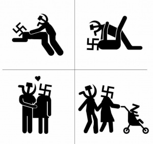

В Пітєрє з'явились мобілізаційні кіоски.
Поки що - добровільні.
Джерело - форум yaplakal.



На окраїнах Московії закінчився охлос, то ж і столичним пассіонаріям дають шанс пропасти без вісті в Україні.

На тому ж форумі стогін: горять ліси, нема кому гасити.
Але середній градус в сусідній палаті все ще спокійний.

І картинок гумористичних назбиралось з інтернету:



В наступній картинці я б першим поставив лівий ніжний фрагмент (співпраця СРСР з Германією перед другою світовою), далі - Друга світова як тваринний секс і фіналом - Московітський недорейх (
[тематично](https://lleo.me/dnevnik/2022/02/28_Z)
):

Гітлер витратив 8 років на те, щоб _мейк фатерлянд грейт егєйн_ і розпочати світову війну.
Путіну на це знадобилось 22 роки.
"На дітях гєніїв природа відпочиває"


