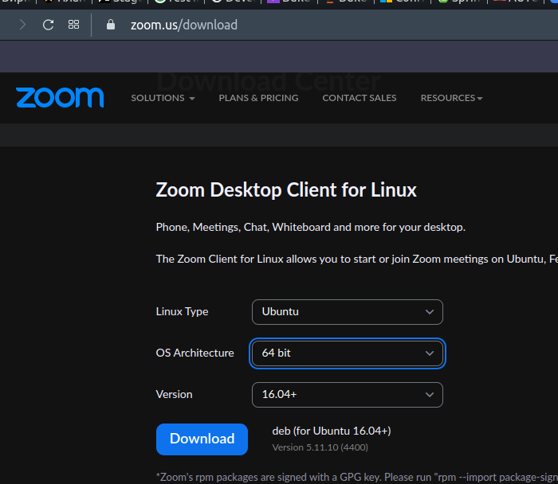
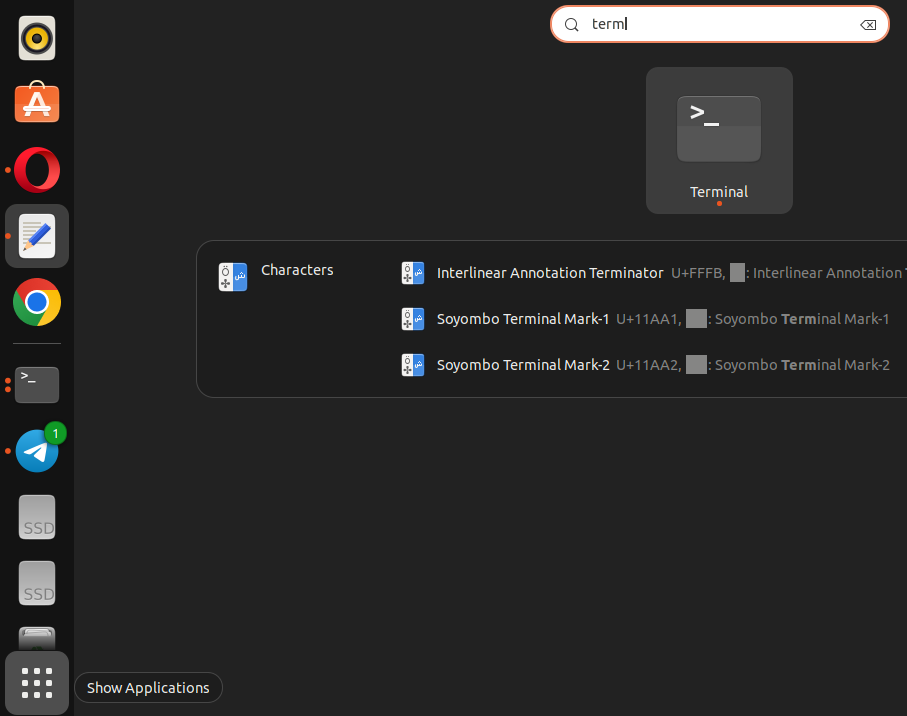
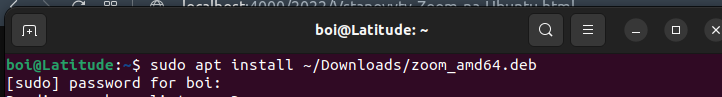
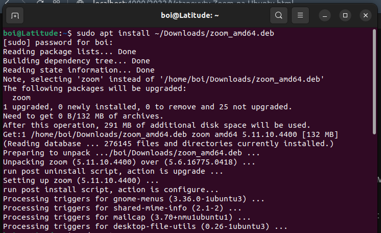

### Підготовка 

Для того, щоб встановити або оновити Zoom до останньої версії на Ubuntu необхідно:

- Скачати локально новую версію програми з 
  [Download center](https://zoom.us/download?os=linux)
  
  Вказати Linux Type: Ubuntu
  
  
  
  натиснути Download
  
- відкрити вікно терміналу.
  Це програма що дозволяє вводити з клавіатури команди і виконувати їх.
  Для цього можна або натиснути `Ctrl Alt T` одночасно або натиснути `Show applications` кнопку на `taskbar` і в рядку пошуку програм написати `terminal`, натиснути Enter
  
   

### apt install

У вікні Terminal набрати команду (після символу `$`)

> sudo apt install ~/Downloads/zoom_amd64.deb

 

де:
- `sudo` префікс до команди, вказує що наступна команда має виконуватись з правами адміністратора
- `apt install` - команда що запускає програму `apt` з параметром `install`
- `~/Downloads/zoom_amd64.deb` - шлях і назва файлу, з якого треба запустити встановлення програми.

  Ця частина може відрізнятись для вашого комп'ютера:

  - `~` це посилання на домашній каталог користувача
  - `Downloads` - ім'я каталогу, де браузери зберігають закачані з інтернету файли зазвичай
  - `zoom_amd64.deb` - ім'я файлу з дистрибутивом програми, що має бути встановлений.
  
Команда `sudo` запитає пароль адміністратора, щоб впевнитись, що користувач має право встановлювати програми

Набираємо пароль, натискаємо Enter.
При наборі паролю курсор рухатись не буде і символи * не з'являтимуться, це нормально.

Якщо все піде добре, то на екрані буде повідомлення про встановлення програми

 
